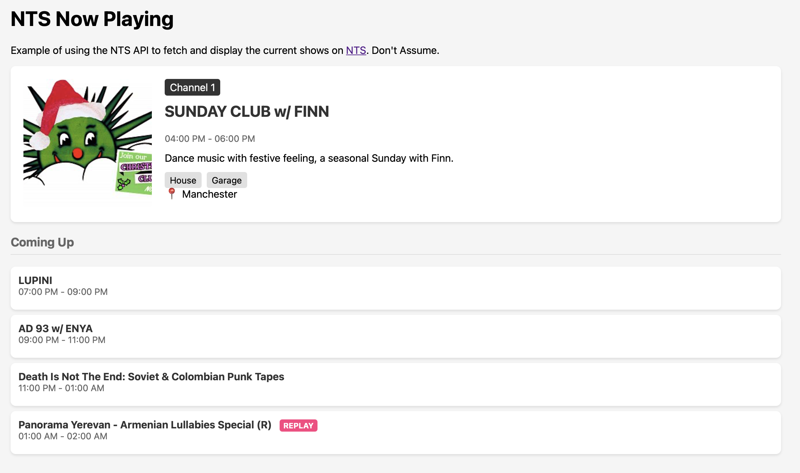

# NTS Now Playing JavaScript Example

A simple web interface that displays the current and upcoming shows on [NTS](https://www.nts.live/)'s two channels. Built using vanilla JavaScript and the NTS Radio API.

- Shows current playing show for both NTS channels
- Displays show images, descriptions, and genres when available
- Lists upcoming shows for each channel
- Auto-refreshes every minute
- Indicates replay shows with a badge
- Responsive design




## Usage

Simply open `nts-now-playing.html` in a web browser. The page will automatically fetch and display the current shows from NTS Radio's API.

## API Example

The project uses the NTS Radio API endpoint: `https://www.nts.live/api/v2/live`

Example response structure (truncated):

```json
{
  "results": [
    {
      "channel_name": "1",
      "now": {
        "broadcast_title": "DARIA KOLOSOVA w/ Social Vlad",
        "start_timestamp": "2024-11-13T01:00:00Z",
        "end_timestamp": "2024-11-13T02:00:00Z",
        "embeds": {
          "details": {
            "name": "DARIA KOLOSOVA w/ Social Vlad",
            "description": "Daria Kolosova's passion for the depths of electronic music have transformed into her striking versatility and proficiency as an artist. Welcome to her world.",
            "genres": [],
            "location_long": "Berlin",
            "media": {
              "picture_medium": "https://media.ntslive.co.uk/resize/400x400/0ab20d37-a879-4bd4-97b7-a3aa2c7445f0_1731369600.jpeg"
            }
          }
        }
      },
      "next": {
        "broadcast_title": "Honey Dijon (R)",
        "start_timestamp": "2024-11-13T02:00:00Z",
        "end_timestamp": "2024-11-13T03:00:00Z"
      }
      // ... more upcoming shows
    }
    // ... channel 2 data
  ]
}
```

See `api_result.json` for a full example.

## License

MIT
